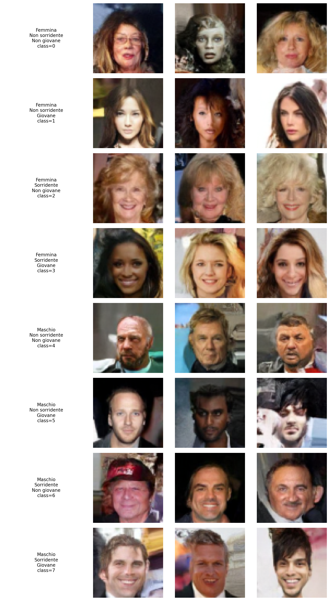

# 🎨 Conditional DDPM – Face Generation on CelebA

> **Denoising Diffusion Probabilistic Model** condizionato per la generazione di volti, addestrato su **CelebA 64×64** con conditioning semantico basato su tre attributi: *Male*, *Smiling*, *Young*.

Progetto realizzato per il corso di **Generative AI**.

---

## 📌 Descrizione del Progetto

Questo progetto implementa un **DDPM (Denoising Diffusion Probabilistic Model)** condizionato, partendo dalla struttura teorica classica e adattandola a un task realistico di **generazione di volti** con controllo semantico. Il modello è in grado di generare immagini di volti condizionati su **8 classi**, ottenute dalla combinazione binaria di tre attributi CelebA:

| Classe | Male | Smiling | Young |
|:------:|:----:|:-------:|:-----:|
| 0 | ✗ | ✗ | ✗ |
| 1 | ✗ | ✗ | ✓ |
| 2 | ✗ | ✓ | ✗ |
| 3 | ✗ | ✓ | ✓ |
| 4 | ✓ | ✗ | ✗ |
| 5 | ✓ | ✗ | ✓ |
| 6 | ✓ | ✓ | ✗ |
| 7 | ✓ | ✓ | ✓ |

La formula di codifica della classe è: `class = male × 4 + smiling × 2 + young`.

---

## 🖼️ Risultati

Griglia di generazione condizionata (3 sample per classe, epoch 500):



---

## 🏗️ Architettura

### UNet Condizionata

Il modello utilizza un'architettura **UNet** con feature pyramid `[64, 128, 256, 512]`, progettata per immagini RGB 64×64. Ogni blocco della UNet:

- **Encoder**: due convoluzioni con `BatchNorm2d` + `SiLU`, stride 2 per il downsampling
- **Decoder**: convoluzione + `ConvTranspose2d` con stride 2 per l'upsampling
- **Skip connections**: i feature map dell'encoder vengono concatenati con quelli del decoder e combinati tramite un convolution 1×1

Il **conditioning** (one-hot a 8 dimensioni) e il **time encoding** vengono iniettati in ogni blocco della UNet tramite concatenazione spaziale.

### Time Encoding

Viene utilizzato un encoding sinusoidale custom con frequenze logaritmicamente distribuite (`dim = 128`), ispirato al positional encoding dei transformer.

### Noise Schedule

Si utilizza una **cosine schedule** con parametro di smoothing `s = 0.008` e `L = 1000` timestep, che produce una transizione più graduale rispetto alla schedule lineare classica.

---

## ⚙️ Scelte Progettuali

### Conditioning Semantico

A differenza di un esercizio didattico base dove la condizione è una classe semplice, qui si è scelto di combinare tre attributi binari di CelebA (*Male*, *Smiling*, *Young*) in una singola classe a 8 valori tramite one-hot encoding. Questo consente di pilotare la generazione verso soggetti con caratteristiche specifiche (es. *uomo giovane sorridente* oppure *donna non giovane non sorridente*).

### Classifier-Free Guidance con Schedule Dinamica

Durante il training viene applicato un **classifier-free guidance** con probabilità di drop del conditioning `p_drop = 0.2`. In fase di sampling, la guidance non è costante ma segue una **schedule crescente** (*dynamic guidance*):

```
λ(t) = λ_min + (λ_max − λ_min) × progress^γ
```

dove `progress ∈ [0, 1]` indica l'avanzamento del reverse process (da molto rumoroso a poco rumoroso). I parametri finali adottati sono:

| Parametro | Valore |
|:---------:|:------:|
| `λ_max` (lam) | 2.3 |
| `λ_min` | 1.3 |
| `γ` (gamma) | 2.3 |

Questa scelta consente una guidance moderata nelle fasi iniziali (dove forzare troppo la condizione introduce artefatti) e più forte nelle fasi finali, dove il controllo semantico è più efficace.

### Sampling DDIM

Per la generazione delle immagini si utilizza il sampler **DDIM** con i seguenti iperparametri ottimizzati empiricamente:

| Parametro | Valore |
|:---------:|:------:|
| `stride` | 4 |
| `eta` | 0.25 |
| `lam` | 2.3 |

Il passo DDIM con `eta = 0.25` introduce una leggera stocasticità, offrendo un buon compromesso tra qualità visiva, varietà e coerenza con la condizione richiesta.

### Training

| Iperparametro | Valore |
|:-------------:|:------:|
| Epoche | 500 |
| Batch size | 128 |
| Learning rate | 2e-4 |
| Scheduler | `CosineAnnealingLR` (eta_min = 1e-6) |
| Optimizer | Adam |
| Timestep (L) | 1000 |

Il training è stato eseguito su un **cluster HPC con Slurm**, con gestione automatica di:
- Selezione del device GPU e inizializzazione CUDA
- **Checkpoint periodici** con resume automatico (indispensabile per completare le 500 epoche entro i limiti temporali delle partizioni)
- Salvataggio di preview DDIM ogni 5 epoche per monitoraggio qualitativo

---

## 📂 Struttura del Progetto

```
.
├── ddpm.py                                              # Training DDPM condizionato
├── test_ddpm.py                                         # Generazione griglia di valutazione
├── ddpm_generation_grid_3samples_epoch_500_Finale.png   # Risultato generazione condizionata
└── README.md
```

### `ddpm.py` — Training

Script principale che implementa:
- **Dataset wrapper** `CelebACond` che mappa gli attributi CelebA in 8 classi
- **Noise schedule** cosine e **time encoding** sinusoidale
- **UNet condizionata** con 4 livelli di feature
- **Training loop** con classifier-free guidance, checkpoint/resume, e preview DDIM periodiche

### `test_ddpm.py` — Inferenza e Valutazione

Script dedicato che:
- Carica il checkpoint finale (epoch 500)
- Genera una griglia ordinata di immagini per tutte le 8 combinazioni di attributi
- Salva il risultato come immagine PNG ad alta risoluzione

---

## 🚀 Utilizzo

### Requisiti

```
torch
torchvision
matplotlib
```

### Training

```bash
python ddpm.py
```

> ⚠️ Il training richiede una GPU con almeno ~8 GB di VRAM. I percorsi del dataset (`DATA_ROOT`) e dell'output (`OUT_DIR`) sono configurabili nel file.

### Generazione

```bash
python test_ddpm.py
```

> Richiede un checkpoint addestrato. Aggiornare `CHECKPOINT_PATH` e `OUTPUT_DIR` nel file.

---

## 📚 Riferimenti

- Ho, J., Jain, A., & Abbeel, P. (2020). *Denoising Diffusion Probabilistic Models*. NeurIPS 2020.
- Nichol, A. Q., & Dhariwal, P. (2021). *Improved Denoising Diffusion Probabilistic Models*. ICML 2021.
- Song, J., Meng, C., & Ermon, S. (2021). *Denoising Diffusion Implicit Models*. ICLR 2021.
- Ho, J., & Salimans, T. (2022). *Classifier-Free Diffusion Guidance*.
