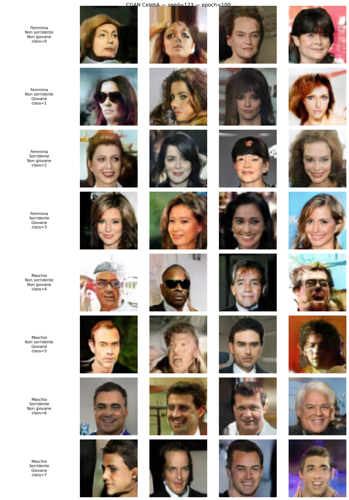
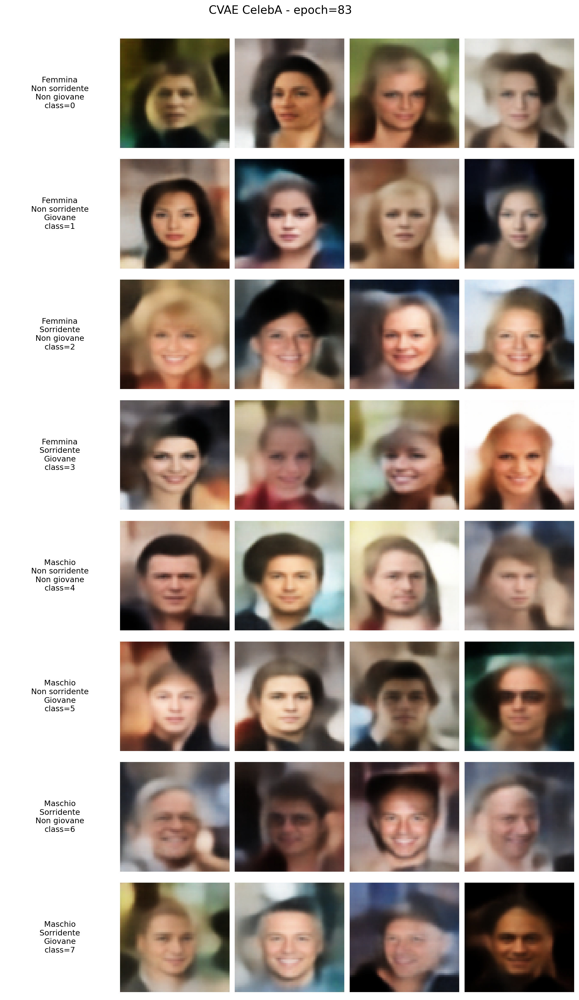

# 🎨 Generative AI — Face Generation on CelebA

> Progetto per il corso di **Generative AI** — generazione condizionata di volti tramite **DDPM** e **CGAN**, addestrati su **CelebA 64×64** con conditioning semantico basato su tre attributi: *Male*, *Smiling*, *Young*.

---

# Conditional DDPM – Face Generation on CelebA

> **Denoising Diffusion Probabilistic Model** condizionato per la generazione di volti, addestrato su **CelebA 64×64** con conditioning semantico basato su tre attributi: *Male*, *Smiling*, *Young*.

---

## 📌 Descrizione del Progetto

Questo progetto implementa un **DDPM (Denoising Diffusion Probabilistic Model)** condizionato, partendo dalla struttura teorica classica e adattandola a un task realistico di **generazione di volti** con controllo semantico. Il modello è in grado di generare immagini di volti condizionati su **8 classi**, ottenute dalla combinazione binaria di tre attributi CelebA:

| Classe | Male | Smiling | Young |
|:------:|:----:|:-------:|:-----:|
| 0 | ✗ | ✗ | ✗ |
| 1 | ✗ | ✗ | ✓ |
| 2 | ✗ | ✓ | ✗ |
| 3 | ✗ | ✓ | ✓ |
| 4 | ✓ | ✗ | ✗ |
| 5 | ✓ | ✗ | ✓ |
| 6 | ✓ | ✓ | ✗ |
| 7 | ✓ | ✓ | ✓ |

La formula di codifica della classe è: `class = male × 4 + smiling × 2 + young`.

---

## 🖼️ Risultati

Griglia di generazione condizionata (3 sample per classe, epoch 500):


---

## 🏗️ Architettura

### UNet Condizionata

Il modello utilizza un'architettura **UNet** con feature pyramid `[64, 128, 256, 512]`, progettata per immagini RGB 64×64. Ogni blocco della UNet:

- **Encoder**: due convoluzioni con `BatchNorm2d` + `SiLU`, stride 2 per il downsampling
- **Decoder**: convoluzione + `ConvTranspose2d` con stride 2 per l'upsampling
- **Skip connections**: i feature map dell'encoder vengono concatenati con quelli del decoder e combinati tramite un convolution 1×1

Il **conditioning** (one-hot a 8 dimensioni) e il **time encoding** vengono iniettati in ogni blocco della UNet tramite concatenazione spaziale.

### Time Encoding

Viene utilizzato un encoding sinusoidale custom con frequenze logaritmicamente distribuite (`dim = 128`), ispirato al positional encoding dei transformer.

### Noise Schedule

Si utilizza una **cosine schedule** con parametro di smoothing `s = 0.008` e `L = 1000` timestep, che produce una transizione più graduale rispetto alla schedule lineare classica.

---

## ⚙️ Scelte Progettuali

### Conditioning Semantico

A differenza di un esercizio didattico base dove la condizione è una classe semplice, qui si è scelto di combinare tre attributi binari di CelebA (*Male*, *Smiling*, *Young*) in una singola classe a 8 valori tramite one-hot encoding. Questo consente di pilotare la generazione verso soggetti con caratteristiche specifiche (es. *uomo giovane sorridente* oppure *donna non giovane non sorridente*).

### Classifier-Free Guidance con Schedule Dinamica

Durante il training viene applicato un **classifier-free guidance** con probabilità di drop del conditioning `p_drop = 0.2`. In fase di sampling, la guidance non è costante ma segue una **schedule crescente** (*dynamic guidance*):

```
λ(t) = λ_min + (λ_max − λ_min) × progress^γ
```

dove `progress ∈ [0, 1]` indica l'avanzamento del reverse process (da molto rumoroso a poco rumoroso). I parametri finali adottati sono:

| Parametro | Valore |
|:---------:|:------:|
| `λ_max` (lam) | 2.3 |
| `λ_min` | 1.3 |
| `γ` (gamma) | 2.3 |

Questa scelta consente una guidance moderata nelle fasi iniziali (dove forzare troppo la condizione introduce artefatti) e più forte nelle fasi finali, dove il controllo semantico è più efficace.

### Sampling DDIM

Per la generazione delle immagini si utilizza il sampler **DDIM** con i seguenti iperparametri ottimizzati empiricamente:

| Parametro | Valore |
|:---------:|:------:|
| `stride` | 4 |
| `eta` | 0.25 |
| `lam` | 2.3 |

Il passo DDIM con `eta = 0.25` introduce una leggera stocasticità, offrendo un buon compromesso tra qualità visiva, varietà e coerenza con la condizione richiesta.

### Training

| Iperparametro | Valore |
|:-------------:|:------:|
| Epoche | 500 |
| Batch size | 128 |
| Learning rate | 2e-4 |
| Scheduler | `CosineAnnealingLR` (eta_min = 1e-6) |
| Optimizer | Adam |
| Timestep (L) | 1000 |

Il training è stato eseguito su un **cluster HPC con Slurm**, con gestione automatica di:
- Selezione del device GPU e inizializzazione CUDA
- **Checkpoint periodici** con resume automatico (indispensabile per completare le 500 epoche entro i limiti temporali delle partizioni)
- Salvataggio di preview DDIM ogni 5 epoche per monitoraggio qualitativo

---

## 📂 Struttura del Progetto

```
.
├── ddpm.py                                              # Training DDPM condizionato
├── test_ddpm.py                                         # Generazione griglia di valutazione
├── ddpm_generation_grid_3samples_epoch_500_Finale.png   # Risultato generazione condizionata
└── README.md
```

### `ddpm.py` — Training

Script principale che implementa:
- **Dataset wrapper** `CelebACond` che mappa gli attributi CelebA in 8 classi
- **Noise schedule** cosine e **time encoding** sinusoidale
- **UNet condizionata** con 4 livelli di feature
- **Training loop** con classifier-free guidance, checkpoint/resume, e preview DDIM periodiche

### `test_ddpm.py` — Inferenza e Valutazione

Script dedicato che:
- Carica il checkpoint finale (epoch 500)
- Genera una griglia ordinata di immagini per tutte le 8 combinazioni di attributi
- Salva il risultato come immagine PNG ad alta risoluzione

---

## 🚀 Utilizzo

### Requisiti

```
torch
torchvision
matplotlib
```

### Training

```bash
python ddpm.py
```

> ⚠️ Il training richiede una GPU con almeno ~8 GB di VRAM. I percorsi del dataset (`DATA_ROOT`) e dell'output (`OUT_DIR`) sono configurabili nel file.

### Generazione

```bash
python test_ddpm.py
```

> Richiede un checkpoint addestrato. Aggiornare `CHECKPOINT_PATH` e `OUTPUT_DIR` nel file.

---

## 📚 Riferimenti

- Ho, J., Jain, A., & Abbeel, P. (2020). *Denoising Diffusion Probabilistic Models*. NeurIPS 2020.
- Nichol, A. Q., & Dhariwal, P. (2021). *Improved Denoising Diffusion Probabilistic Models*. ICML 2021.
- Song, J., Meng, C., & Ermon, S. (2021). *Denoising Diffusion Implicit Models*. ICLR 2021.
- Ho, J., & Salimans, T. (2022). *Classifier-Free Diffusion Guidance*.

---
---

# Conditional GAN (CGAN) – Face Generation on CelebA

> **Conditional Generative Adversarial Network** per la generazione di volti 64×64 condizionati sugli stessi tre attributi CelebA: *Male*, *Smiling*, *Young*.

---

## 📌 Descrizione

Il modello implementa una **CGAN** (Conditional GAN) con architettura convoluzionale ispirata a DCGAN, condizionata sulle stesse 8 classi utilizzate dal DDPM. Il generatore produce immagini a partire da un vettore latente `z ~ N(0,1)` di dimensione 128 concatenato alla condizione one-hot, mentre il discriminatore valuta la coerenza tra immagine e condizione mediante injection spaziale della condizione nelle feature map intermedie.

La codifica della classe è identica al DDPM: `class = male × 4 + smiling × 2 + young`.

---

## 🖼️ Risultati

Griglia di generazione condizionata (4 sample per classe, epoch 100):



---

## 🏗️ Architettura

### Generator

Il generatore segue lo schema DCGAN con upsampling progressivo tramite `ConvTranspose2d`:

```
z (128) + c (8 one-hot) → Linear → 1024×4×4
→ ConvT 1024→512  (8×8)   + BN + ReLU
→ ConvT 512→256   (16×16)  + BN + ReLU
→ ConvT 256→128   (32×32)  + BN + ReLU
→ ConvT 128→64    (64×64)  + BN + ReLU
→ Conv  64→3      (64×64)  + Tanh → output in [-1,1]
```

Il condizionamento avviene concatenando il vettore one-hot della classe al vettore latente `z` prima del layer fully connected, seguendo il pattern proposto a lezione per le CGAN.

### Discriminator

Il discriminatore utilizza convoluzioni con stride per il downsampling e injection spaziale della condizione:

```
x (3×64×64)
→ Conv 3→64    (32×32) + LeakyReLU
→ Conv 64→128  (16×16) + BN + LeakyReLU
── injection condizione: c one-hot espanso a (8×16×16) e concatenato sui canali ──
→ Conv 136→256 (8×8)   + BN + LeakyReLU
→ Conv 256→512 (4×4)   + BN + LeakyReLU
→ Flatten → Dropout(0.25) → Linear → Sigmoid
```

La condizione viene iniettata come mappa spaziale tra `net1` e `net2`: il vettore one-hot viene espanso a 4D con `c[:,:,None,None].expand(-1,-1,16,16)` e concatenato alle feature map sui canali. Questo permette al discriminatore di verificare la coerenza tra condizione e contenuto visivo a livello locale, non solo globale — lo stesso approccio utilizzato dal professore nell'esercizio CGAN su MNIST e nel codice di colorizzazione.

---

## ⚙️ Scelte Progettuali

### Inizializzazione DCGAN

I pesi vengono inizializzati con distribuzioni normali come da paper DCGAN: `N(0, 0.02)` per i layer convoluzionali e lineari, `N(1, 0.02)` per la BatchNorm. Questo riduce il rischio che il discriminatore impari troppo velocemente rispetto al generatore nelle prime epoche.

### Normalizzazione [-1, 1] e Tanh

Le immagini vengono normalizzate nel range `[-1, 1]` tramite `Normalize(0.5, 0.5, 0.5)` e il generatore utilizza `Tanh` come attivazione finale, garantendo coerenza di scala tra dati reali e generati. Questa scelta è preferibile rispetto a `Sigmoid` + `[0,1]` perché centra i dati sullo zero, facilitando il training della BatchNorm.

### Stabilizzazione del Training

Il training delle GAN è intrinsecamente instabile a causa della natura adversariale. Sono state adottate diverse tecniche per bilanciare generatore e discriminatore:

- **Label Smoothing (0.1)**: i target del discriminatore vengono "smussati" (0.9 per i reali, 0.1 per i sintetici) per impedire al discriminatore di imparare una funzione di separazione troppo perfetta, come suggerito a lezione.

- **Instance Noise fisso (σ = 0.015)**: un piccolo rumore gaussiano viene aggiunto alle immagini passate al discriminatore, forzandolo a imparare una funzione meno netta. Questa tecnica è presentata nelle slide come soluzione al problema del vantaggio iniziale del discriminatore. Si è scelto un valore fisso anziché un decay lineare dopo aver osservato sperimentalmente che il decay verso zero causava un crollo delle performance nelle epoche tarde.

- **Learning Rate asimmetrico**: il generatore utilizza `lr = 2e-4` e il discriminatore `lr = 1e-4`. Questo rallenta l'apprendimento del discriminatore, dando al generatore il tempo di migliorare e mantenendo l'equilibrio adversariale.

- **Dropout (0.25)**: applicato nel discriminatore prima del layer lineare finale come ulteriore regolarizzazione.

- **Riduzione del momentum di Adam**: `betas = (0.5, 0.999)` per ridurre l'inerzia dell'ottimizzatore, che può amplificare oscillazioni nel training adversariale.

### Dataset

Si utilizza `split="all"` del dataset CelebA (~200k immagini) anziché il solo training set. Trattandosi di un modello generativo, non è necessario un test set per valutare la generalizzazione: l'obiettivo è modellare la distribuzione `p(x|c)` nel modo più accurato possibile, e più dati vengono utilizzati, migliore è l'approssimazione.

### Training Loop

L'aggiornamento segue l'algoritmo standard presentato a lezione:

1. Generazione di immagini sintetiche con il generatore
2. Aggiornamento del discriminatore con `detach()` sulle immagini sintetiche (per non propagare gradienti al generatore)
3. Secondo forward pass attraverso il discriminatore per calcolare la loss del generatore
4. Aggiornamento del generatore

Questa procedura con doppio forward pass è preferita all'uso di `retain_graph=True` per efficienza di memoria.

### Monitoraggio

Durante il training vengono salvati:
- **Sample con seed fisso (123)**: per monitorare la convergenza del modello sugli stessi punti dello spazio latente
- **Sample con seed variabile**: per verificare la diversità e l'assenza di mode collapse
- **Log CSV** con GLoss, DLoss, Dtrue, Dsynth per ogni epoca

Il checkpoint migliore viene selezionato in base alla qualità visiva dei sample e alla stabilità dell'equilibrio Dtrue/Dsynth, come suggerito dagli appunti: "ci si ferma quando otteniamo risultati soddisfacenti per il generatore".

### Training

| Iperparametro | Valore |
|:-------------:|:------:|
| Epoche (checkpoint) | 100 |
| Batch size | 128 |
| Learning rate G | 2e-4 |
| Learning rate D | 1e-4 |
| Latent size | 128 |
| Label smoothing | 0.1 |
| Instance noise | 0.015 (fisso) |
| Dropout D | 0.25 |
| Optimizer | Adam (β₁=0.5, β₂=0.999) |

Il training è stato eseguito su **cluster HPC UNISA con Slurm** (partizione `gpuq`), con checkpoint periodici e resume automatico.

---

## 📂 Struttura del Progetto (GAN)

```
.
├── train_cgan_G1024.py                        # Training CGAN condizionata
├── generate.py                                # Generazione griglia di valutazione
├── cgan_generation_grid_4samples_epoch_100.png  # Risultato generazione condizionata
└── weights/                                   # Pesi del modello (Google Drive)
```

### `train_cgan_G1024.py` — Training

Script principale che implementa:
- **Generator** convoluzionale con 1024 canali iniziali e upsampling progressivo
- **Discriminator** con injection spaziale della condizione
- **Training loop** con label smoothing, instance noise, checkpoint/resume, e sample periodici

### `generate.py` — Inferenza e Valutazione

Script dedicato che:
- Carica un checkpoint addestrato
- Genera una griglia ordinata di immagini per tutte le 8 combinazioni di attributi
- Supporta seed personalizzabile per riproducibilità
- Salva il risultato come immagine PNG

---

## 🚀 Utilizzo (GAN)

### Training

```bash
python train_cgan_G1024.py \
  --data_root /path/to/CELEBA \
  --epochs 100 \
  --batch_size 128 \
  --num_workers 6 \
  --out_dir runs/cgan_celeba
```

### Generazione

```bash
python generate.py \
  --checkpoint weights/cgan_epoch_100.pt \
  --n_per_class 4 \
  --seed 123
```

> ⚠️ Il training richiede una GPU. I pesi del modello sono disponibili su [Google Drive](https://drive.google.com/drive/folders/1YF0rMjRUV6R5EyLJBt2eNkpLvhr3K0rt?usp=drive_link).

---

## 📚 Riferimenti (GAN)

- Goodfellow, I. J. et al. (2014). *Generative Adversarial Networks*. NeurIPS 2014.
- Radford, A., Metz, L., & Chintala, S. (2015). *Unsupervised Representation Learning with Deep Convolutional Generative Adversarial Networks* (DCGAN).
- Mirza, M. & Osindero, S. (2014). *Conditional Generative Adversarial Nets*.


---
---

# Conditional VAE (CVAE) – Face Generation on CelebA

> **Conditional Variational Autoencoder** per la generazione di volti 64×64, con iniezione della condizione sia nell'encoder che nello spazio latente per un controllo semantico preciso.

---

## 📌 Descrizione

Questo modello implementa un **CVAE** che mappa le immagini in uno spazio latente di dimensione 128, regolarizzato tramite *Kullback-Leibler Divergence*. L'architettura è in grado di ricostruire volti esistenti o generarne di nuovi a partire da rumore gaussiano, assicurando che i tratti generati rispettino i tre attributi semantici richiesti (*Male*, *Smiling*, *Young*).

A differenza di un VAE standard, la condizione (un vettore a 3 dimensioni) viene iniettata in due punti strategici:
1.  **Nell'Encoder**: concatenata all'immagine di input, permettendo al modello di apprendere una rappresentazione latente che è già consapevole della condizione.
2.  **Nel Decoder**: concatenata al vettore latente `z`, guidando il processo di ricostruzione per generare un'immagine coerente con gli attributi specificati.

---

## 🖼️ Risultati

Griglia di generazione condizionata (4 sample per classe, epoch 83):



---

## 🏗️ Architettura

Il modello `CVAE` è composto da un Encoder e un Decoder interamente convoluzionali:

-   **Encoder**: Riceve in input un'immagine RGB (3 canali) e la condizione (3 canali) espansa spazialmente, per un totale di 6 canali. Utilizza una serie di `Conv2d` con `BatchNorm2d` e `LeakyReLU` per comprimere l'input in una mappa di feature `256x4x4`. Due layer lineari finali generano i parametri della distribuzione latente: media (`mu`) e varianza logaritmica (`logvar`).

-   **Reparameterization Trick**: Campiona un vettore latente `z` dalla distribuzione `N(mu, logvar)` in modo differenziabile.

-   **Decoder**: Riceve il vettore latente `z` (dim 128) concatenato con il vettore delle condizioni `c` (dim 3). Attraverso una serie di `ConvTranspose2d`, `BatchNorm2d` e `LeakyReLU`, esegue l'upsampling fino a generare un'immagine 64×64. L'attivazione finale è `Tanh`, che mappa i pixel nell'intervallo `[-1, 1]`.

---

## ⚙️ Scelte Progettuali

### Filtro Dataset e Normalizzazione Tanh
Il Dataloader filtra i 40 attributi di CelebA per mantenere solo i 3 richiesti. Le immagini vengono normalizzate nel range `[-1, 1]` per essere compatibili con l'output `Tanh` del generatore, garantendo coerenza di scala e stabilità cromatica.

### Loss Function
La funzione di costo è una combinazione di due componenti:
1.  **Reconstruction Loss (BCE)**: Binary Cross Entropy tra l'immagine originale e quella ricostruita, per misurare la fedeltà della ricostruzione.
2.  **Kullback-Leibler Divergence (KLD)**: Calcolata analiticamente per spingere la distribuzione latente appresa ad assomigliare a una normale standard `N(0, 1)`, garantendo uno spazio latente liscio e continuo.

### Checkpoint Manager
Per gestire training lunghi su cluster HPC, è stata utilizzata una classe `CheckpointManager` che salva periodicamente (ogni 5 minuti) l'intero stato del training: pesi del modello, stato dell'ottimizzatore e numero di epoca. Questo permette un resume automatico e sicuro in caso di interruzioni, mantenendo solo gli ultimi 3 checkpoint per ottimizzare lo spazio su disco.

### Training

| Iperparametro | Valore |
|:-------------:|:------:|
| Epoche | 100 (best checkpoint: 83) |
| Batch size | 128 |
| Learning rate | 1e-3 |
| Optimizer | Adam |
| Latent dimension (`z`) | 128 |
| Condition dimension (`c`) | 3 |

---

## 📂 Struttura del Progetto (CVAE)

```text
.
├── vae/
│   ├── train.py                           # Script principale per il training
│   ├── generate_samples.py                  # Script per generare la griglia di valutazione
│   ├── test.py                              # Script per test e campionamento casuale
│   ├── config.py                            # File di configurazione iperparametri
│   ├── modules/
│   │   ├── conditional_vae.py               # Architettura PyTorch del CVAE
│   │   ├── dataset.py                       # Dataloader e gestione attributi
│   │   ├── loss.py                          # Funzione di costo (BCE + KLD)
│   │   ├── trainer.py                       # Loop di training con checkpointing
│   │   └── checkpoint_manager.py            # Utility per salvataggio e resume
│   └── logs/                                # Log del training
└── cvae_generation_grid.png                 # Immagine dei risultati
```

---

## 🚀 Utilizzo (CVAE)

### Training

```bash
python vae/train.py
```
> Lo script utilizza i percorsi e gli iperparametri definiti in `vae/config.py`. Assicurarsi che il dataset CelebA sia disponibile nel percorso specificato.

### Generazione

```bash
python vae/generate_samples.py
```
> Genera una griglia di campioni utilizzando un checkpoint addestrato. Il percorso del checkpoint è configurabile all'interno dello script.

### Testing

```bash
python vae/test.py
```
> Esegue test di ricostruzione sul test set e genera campioni casuali.

---

## 📚 Riferimenti (VAE)

- Kingma, D. P., & Welling, M. (2013). *Auto-Encoding Variational Bayes*.
- Sohn, K., Lee, H., & Yan, X. (2015). *Learning Structured Output Representation using Deep Conditional Generative Models*.